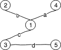

# Diskret matematik

## Definitioner

### Talgrupper

$\mathbb{N}=\{1,2,3,…\}$ betecknar de naturliga talen. Positiva heltal. Av tradition ingår ibland $0$, ibland inte.

$\mathbb{Z}=\{…,-3,-2,-1,0,1,2,3,…\}$ betecknar de hela talen. Alla heltal.

$\mathbb{Q}=\{\frac{a}{b}:a,b\in \mathbb{Z} \& b ≠ 0\}$ betecknar de rationella talen.

$\mathbb{R}$ betecknar rationella och irrationella tal (reella tal). Kan placeras på tallinjen.

$\mathbb{C} =\{a+bi:a,b\in R\}$ betecknar komplexa tal.

### Funktionsbegrepp

En funktion $f:A\rightarrow B$ är en regel som för varje element $a$ i $A$ ordnas till precis __ett__ element $b$ i $B$. 

En funktion är __injektiv__ om $a_1≠a_2\Rightarrow f(a_1)≠f(a_2)$. Ett element i $B$ får träffast högst en gång.

En funktion är __surjektiv__ om $\forall b \in B, \exists a \in A$ så att $f(a)=b$. Alla element i $B$ träffas minst en gång.

En funktion är __bijektiv__ om den är både injektiv och surjektiv. En sådan funktion är inverterbar.

Antalet funktioner från mängden $X$ till mängden $Y$ är $|Y|^{|X|}$ då varje element i $X$ har $Y$ element att välja mellan.

Bijektioner mellan två mängder finns enbart för mängder av samma storlek (eller oändliga).

### Mängdlära

#### Beteckningar

Den tomma mängden betecknas $\emptyset$.

$A\subseteq B$ betecknar att $A$ är en _delmängd_ till $B$. Det vill säga att alla element i $A$ finns i $B$.

$x\in A$ betecknar att $x$ finns i $A$.

$|A|$ betecknar kardinaliteten hos $A$, det vill säga antalet element.

$A\cap B$ betecknar snittet av $A$ och $B$. Det vill säga alla element som finns i både $A$ och $B$.

$A\cup B$ betecknar unionen av $A$ och $B$. Det vill säga alla element som finns i antingen $A$ eller $B$.

$A \setminus B$ betecknar mängden ${a\in A | a \notin B}$. Det vill säga alla element i $A$ som inte finns i $B$, "$A$ inte $B$".

$\mathcal{u}$ betecknar universalmängden. I den finns alla element i sammanhanget.

$A^c$ eller $\mathcal{u}\setminus A$ betecknar komplementet till $A$. Det vill säga alla element som inte finns i $A$.

### Binära operationer

En binär operation är en funktion som tar två objekt och "spottar ut" ett objekt.

#### de Morgans teorem

$$
(A\cup B)^c = A^c\cap B^c \\
(A\cap B)^c = A^c\cup B^c \\
$$

#### Kardinalitet

Två mängder har samma kardinalitet om det finns en bijektiv funktion (bijektion) mellan dem. En sådan mängd är uppräknelig. Med en oändlig, uppräknelig mängd kan ett ändligt antal element tas bort utan att påverka kardinaliteten.

### Logik

#### Beteckningar

$P$ och $Q$  betecknar vanligtvis en händelse.

$\neg P$ betecknar negationen av $P$, det vill säga det motsatta:

$\begin{array}{l|l}P & \neg P \\ s & f \\ s & f\end{array} $

$P\wedge Q$ innebär en konjunktion (snitt ./assets/ och). Det vill säga en händelse när $P$ och $Q$ sker:

$\begin{array}{ll|l}P & Q & P\wedge Q \\ s & s & s \\ s & f & f \\ f & s & f \\ f & s & f \\ f & f & f\end{array}$

$P \vee Q$ innebär en disjunktion (meet / eller). Det vill säge en händelse när $P$ eller $Q$ sker:

$\begin{array}{ll|l}P & Q & P\vee Q \\ s & s & s \\ s & f & s \\ f & s & s \\ f & f & f \end{array}$

$P\Rightarrow Q $ betecknar en implikation. Logiskt ekvivalent med $\neg P \Rightarrow \neg Q$. "$P$ medför $Q$":

$\begin{array}{ll|l}P&Q&P\Rightarrow Q\\s&s&s\\s&f&f\\f&s&s\\f&f&s\end{array}$

$P \iff Q$ betecknar en ekvivalens. Logiskt lika:

$\begin{array}{ll|l}P&Q&P\iff Q \\s&s&s\\s&f&f\\f&s&f\\f&f&s\end{array}$

$\forall x$ betecknar en allkvantifikator. "För alla värden på $x$". Exempelvis $\forall x : P(x)$, "för alla $x$ gäller $P(x)$".

$\exists x$ betecknar en existenskvantifikator. "Det existerar värden på $x$". Exempelvis $\exists x : P(x)$, "det finns $x$ för vilka $P(x)$ gäller".

#### Termer

En sats som alltid är sann sägs vara en tautologi.

En sats som kan vara sann och ibland är det sägs vara satisfierbar.

En sats som aldrig är sann sägs vara en kontradiktion.

### Bevisteknik

Visa att påståendet $A\Rightarrow B$.

#### Direkt bevis

1. Anta att $A$ är sant.
2. Visa att $B$ därför är sant.

#### Motsägelsebevis

1. Anta att $A$ är sant.
2. Anta att $B$ är falskt.
3. Visa att detta leder till en motsägelse (kontradiktion).

#### Kontrapositivt bevis

Man kan bevisa att $B$ är sant genom att anta att $\neg B$ är sant och härleda en motsägelse. Bygger på att $A\Rightarrow B \iff \neg A \Rightarrow \neg B$.

1.  Anta att $B$ är falskt.
2.  Visa att $A$ är falskt.

### Aritmetik

#### Divisionsalgoritm

Om $a$ och $b$ är heltal och $b≠0$ då finns det heltal $q$ och $r$ sådana att
$$
a=bq+r, 0\leq r\lt|b|
$$
där både $q$ och $r$ är entydigt bestämda.

#### Delbarhet

Ett heltal $d$ sägs dela ett heltal $a$ om det finns ett heltal $q$ så att $a=d*q$. Om så är fallet skrivs $d\mid a$ vilket utläses "$d$ delar $a$". Man kan även säga att "$a$ är delbart med $d$" eller att "$a$ är en multipel av $d$". Om $d$ inte delar $a$ skrivs detta $d\nmid a$. Observera att ordningen spelar roll. 

En delare $d$ till $a$ kallas för äkta delare om $1\lt |d| \lt |a|$ det vill säga $d\notin\{-1,1,0,-a,a\}$. 

Om $a\mid b$ och $b\mid a$ gäller att $a=b$ eller $a=-b$. 

Låt låt $d,a,b\in\mathbb{Z}$. Om $d\mid(a*b)$ gäller att $d\mid a$ eller $p\mid b$

#### Linjärkombination

En linjärkombination av två heltal $a$ och $b$ är ett uttryck $xa+yb$ där $x,y \in \mathbb{Z}$. 

Om heltalen $a$ och $b$ har den gemensamma delaren $d$, det vill säga $d\mid a$ och $d\mid b$, då kommer varje linjärkombination av $a$ och $b$ också ha delaren $d$. Det vill säga $d\mid (a+b), d\mid(xa+xb)$.

#### Greatest common divisor, GCD

GCD till $a,b,\in \mathbb{Z}$ är ett heltal $d\gt 0$ som delar $a$ och $b$ och är delbart med varje gemensam delare till $a$ och $b$. Det vill säga att

1. $d\mid a$ och $d\mid b$
2. om $d'\mid a$ och $d'\mid b$ så gäller även att $d'\mid d$

Talet betecknas $GCD(a, b)$.

Notera att man brukar definiera $GCD(0, 0)$ som $0$.
Notera även att om $GCD(a, b)=1$ så sägs $a$ och $b$ vara _relativt prima_ (de har inga gemensamma faktorer).

#### Least common multiple, LCM

LCM till $a,b \in \mathbb{Z}$ är ett positivt tal $m$ som är delbart med $a$ och $b$ och som delar varje gemensam multiple av $a$ och $b$. Det vill säga att

1. $a\mid m$ och $b \mid m$
2. om $a\mid m'$ och $b\mid m'$ så gäller att $m\mid m'$

Talet $m$ betecknas $LCM(a, b)$.

Notera att man brukar definiera $LCM(0, 0)$ som $0$.
Notera även att $\forall a, b \in \mathbb{Z}$ gäller att $LCM(a, b)*GCD(a, b)=a*b$.

#### Euclides algoritm

Givet två heltal $a, b≠0$ används bland annat algoritmen för att bestämma $GCD(a, b)$. Den kan även användas vid beräkning av diofantiska ekvationer.
$$
\begin{align}
a&=b\;q_1\,+r_1 \\
b&=r_1q_2+r_2 \\
r_1&=r_2q_3+r_3 \\
r_2&=r_3q_4+r_4 \\
&... \\
r_{n-2}&=r_{n-1}q_n+r_n \\
r_{n-1}&=r_nq_{n+1}+0
\end{align}
$$
Observera att kedjan alltid är ändlig. Den sista resten som inte är lika med noll, $r_n$ beskriver $GCD(a, b)$. Denna rest kallas för den sista icke-försvinnande resten. Varje enskild rest är alltid strikt större än den nästkommande, $r_1\gt r_2\gt…\geq0$.

#### Primtal

Ett heltal $p\gt 1$ som saknar äkta delare sägs vara ett primtal. Om $p$ är ett primtal har det endast två positiva delade: $1$ och $p$ själv.

#### Aritmetikens fundamentalsats

Varje heltal $n\gt1$ kan skrivas som en produkt av primtail på _ett_ sätt och endast ett sätt. Ordningen hos faktorerna spelare inte roll.

#### Euclides sats

Det finns oänligt många primtal.

#### Diofantiska ekvationer

Heltalslösningar på linjära ekvationer.

Låt $a,b,c$ vara godtyckliga heltal. Problem: bestäm samtliga heltalslösningar till $ax+by=c$. Observera att om $GCD(a,b)\nmid d$ så finns ingen lösning.

Om $x\in y$ satisfierar $ax+by=c$ då kan man skriva $x=x_p+x_h$ och $y=y_p+y_h$ där $x_p,y_p,x_h,y_h$ satisfierarar $ax_p+by_p=c$ och $ax_h+by_h=0$. 

##### Lösning

Vi har ekvationen $ax+by=c​$.

1. Euclides algoritm för att bestämma $GCD(a, b)$
2. Kontrollera att det finns ett tal $d'$ så att $d'*GCD(a, b)\mid c$. Om inte finns inga lösningar
3. Skriv $d$ som linjärkombination av $a$ och $b$.
4. Bestäm $x_p$ och $y_p$ genom att multiplicera linjärkombinationen från steg 3 med $d'$. 
5. Bestäm $x_h$ och $y_h$ genom att lösa $ax_h+by_h=0$

Se gärna exempel nedan.

#### Modulär aritmetik

Låt $n​$ vara ett heltal. Om $a, b \in \mathbb{Z}​$ satisfierar $a=b+nk​$ för något $k\in \mathbb{Z}​$ då skriver vi:
$$
\begin{align}
[a]&=[b]&(1)\\
&\text{eller}\\
a&\equiv b\;(mod\;n)&(2)
\end{align}
$$
Notera att $a$ ur $(1)$ eller $[a]$ ur $(2)$ inte representerar _ett_ tal utan snarare en hel klass av oändligt många tal. 
Notera också att för $a\equiv b\;(mod\;n)$ säger vi "$a$ är lika med $b$ modulo $n$" eller "$a$ är kongruent med $b$ modulo $n$".

Notera även att när vi räknar $mod\;n$ finns det $n$ distinkta element (klasser):
$$
\{[0],[1],...,[n-1]\}=\mathbb{Z}_n
$$
Det vill säga att för $\mathbb{Z}_n$ gäller att $[0]=[n]$.

Addition för $\mathbb{Z}_n$ definieras likt följande.
$$
[a]\oplus[b]=[a+b]\\
\begin{array}{l|l}
+&0&1&2&3&4&5&6 \\
\hline
0&0&1&2&3&4&5&6\\
\hline
1&1&2&3&4&5&6&0\\
\hline
2&2&3&4&5&6&0&1\\
\hline
3&3&4&5&6&0&1&2\\
\hline
4&4&5&6&0&1&2&3\\
\hline
5&5&6&0&1&2&3&4\\
\hline
6&6&0&1&2&3&4&5\\
\end{array}
$$
Multiplikation för $\mathbb{Z}_n$ definieras likt följande.
$$
[a]\odot[b]=[a*b]\\
\begin{array}{l|l}
+&0&1&2&3&4&5&6 \\
\hline
0&0&0&0&0&0&0&0\\
\hline
1&0&1&2&3&4&5&6\\
\hline
2&0&2&4&6&1&3&5\\
\hline
3&0&3&6&2&5&1&4\\
\hline
4&0&4&1&5&2&6&3\\
\hline
5&0&5&3&1&6&4&2\\
\hline
6&0&6&5&4&3&2&1\\
\end{array}
$$

Notera speglingarna i tabellerna. Dessa kommer från att operationerna är kommutativa. Vidare följer operationerna vanliga räkneregler. De är associativa, distributiva och kommutativa.

### Ringar och kroppar

#### Ring

En unital ring $R$ är en icke-tom mängd med två binära operationer $+$ och $*$ som satisiferar följande:

Addition:

* $(a+b)+c=a+b(+c), \forall a,b,c\in R$     (associativ)
* $a+b=b+a, \forall a,b\in R$     (kommutativ)
* $\exists 0 \in R$ så att $a+0=a$
* $\forall a \in R, \exists -a$ så att $a+(-a)=0$

Multiplikation:

* $(a*b)*c=a*(b*c), \forall a,b, c \in R$     (associativ)
* $\exists 1\in R, a*1=a\iff 1*a=a, \forall a\in R$
* $a*(b+c)=(a*b)+(a*c), \forall a,b,c\in R$     (distributiv)
* $(b+c)*a=(b*a)+(c*a)$

#### Kropp

En ring $(R,+,*)$ sägs vara en kropp om följande punkter satisfieras:

1. $a*b=b*a,\forall a,b \in R$     (kommutativ)
2. $\forall a\in R, a≠0$ ska det finnas något $b\in R$ så att $a*b=1$
   För ett element $a*b=1$ betecknar $a^{-1}$ $b$. Det finns enbart en invers

Viktig sats:

Om $p$ är ett primtal är $(\mathbb{Z}_p,+,*)$ en kropp.

### Rekursionsekvationer

En rekursionsekvation "för oss" (diskret) är en ekvation på formen
$$
a_n=f(a_{n-1},a_{n-2},...,a_{n-k}), k\gt 0, f: \mathbb{Z}^k\rightarrow \mathbb{Z}
$$
Om exempelvis $a_1,a_2,…,a_k$ är kända så definierar detta en oändlig talföljd. Detta är ett viktigt specialfall.

Lösningsmetod:

$c_{n-1},c_{n-2},…,c_{n-k}$ är givna, fixa heltal. 

1. Ansätt $a_n=K*r^n$ där $K$ är en godtycklig konstant och $r$ är variabeln vi vill lösa ut 
2. Bestäm möjliga värden för $r$. Det är vanligt med begynnelsevärden
3. Ta alla lösta $r$ och bilda om nödvändigt summan av lösningarna och anpassa $K$-värdena till begynnelsevärdena

Om det enbart finns ett värde för $r$ (dubblerot / trippelrot o.s.v.) så sätts $r_n=(K_1 + K_2*n)r^n$ eller $r_n=(K_1 + K_2*n + K_3*n^3)r^n$ o.s.v.

Detta är snarlikt med lösning av homogena, diofantiska ekvationer.

### Induktion

Låt $P(n), n\in \mathbb{N}$ vara ett påstående.

Princip: vi kan visa att $P(n)$ är sant för alla $n\in\mathbb{N}$ genom att visa:

1. $P(0)$ är sant
2. För gotyckligt $n\in\mathbb{N}$ gäller $P(n)\Rightarrow P(n+1)$

Detta är likt domino-brickor. Den första faller. Faller den andra, då faller resten.

### Fermats lilla sats

Låt $p$ vara ett primtal. Då gäller följande:

1. $a^p\equiv a\;(mod\;p),\forall a\in\mathbb{Z}$
2. $a^{p-1}\equiv 1\;(mod\;p), \forall a\in\mathbb{Z}$ så att $a\notin \mathbb{Z}$

Notera att för punkt 2 gäller att $a\notin \mathbb{Z}$ betyder att $a$ inte är en multipel av $p$.

Notera även följande:

1. $(Z_p\setminus\{[0]\},*)$ är en grupp
2. $[a]^p=[a],\forall[a]\in \mathbb{Z}_p \setminus\{[0]\}$ samt att $[a]^{p-1}=[1],\forall[a]\in\mathbb{Z}_p\setminus\{[0]\}$
3. Punkt 1 gäller trivialt om $[a]=[0]$. Om $[a]≠[0]$ så är $[a]$ inverterbar. Detta ger:
   $[a]^p=[a]\Rightarrow[a]^{p-1}=[1]$
4. Slutsats: Fermats punkt 1 och 2 är ekvivalenta.

### "$3n+1$-förmodan" eller Ulom/Collaz-förmodan

Vi kan bilda talföljden
$$
a_{n+1}=\left\{\begin{array}{ll}
a_n/2&\text{om }a_n \text{ jämnt})\\
3a_n+1&\text{om }a_n \text{ udda}
\end{array}\right.
$$
Betrakta till exempel följande följder:
$$
\underbrace{4,2,1}_\text{upprepning},4,2,1,...\\
7,22,11,34,17,52,26,13,40,20,10,5,16,\underbrace{4,2,1}_\text{upprepning},...
$$
Det är ej bevisat, men det tycks stämma att man alltid kommer till $1$ trots val av tal.

### Kombinatorik

#### Additionsprincipen

Om det finns $n$ sätt att behandla ett fall $X$ och $m$ sätt att behandla ett annat fall $Y$ där $X$ och $Y$ är disjunkta (de har inget gemensamt / oberoende) då finns $n+m$ sätt att behandla antingen $X$ __eller__ $Y$.

#### Multiplikationsprincipen

Om det finns $n$ sätt att behandla ett fall $X$ och $m$ sätt att behandla ett annat fall $Y$ där $X$ och $Y$ är disjunkta (de har inget gemensamt) då finns $n*m$ sätt att behandla antingen $X$ __och__ $Y$.

#### Permutationer

En viss ordning av element i en mängd kallas en __permutation__ av elementen i mängden.

##### Ordnat urval

Om det finns $n$ st disjunkta objekt och $r$ är ett heltal, $1\leq r \leq n$, då är antalet permutationer av längd $r$ av $n$ objekt lika med
$$
P(n,r)=\frac{n!}{(n-r)!}
$$
Notera: Av tradition definierar man $0!=1$

Notera: om det finns $n$ objekt med $n_1$ av en första typ, $n_2$ av en andra typ,…, och $n_n$ av en $r$:te typ där
$$
n=n_1+n_2+...+n_r
$$
Då finns följande antal permutationer av objekten
$$
\frac{n!}{n_1!*n_2!*...*n_n!}
$$

#### Kombinationer

Urval utan hänsyn till ordning och utan upprepning.

Om vi har $n$ distinkta objekt kommer varje kombination av $r$ st av de $n$ objekten ha följande antal möjliga kombinationer:
$$
C(n,r)=\frac{P(n,r)}{r!}=\binom{n}{r}=\frac{n!}{r!(n-r)!}
$$

##### Binomialsatsen

$$
(a+b)^n=\sum_{k=0}^n\binom{n}{k}*a^{n-k}*b^k, n\in\mathbb{N},\;a,b\in\mathbb{C}
$$

#### Diriclets lådprincip

Om $m$ kulor placeras i $n$ lådor och $m\gt n$ då finns det minst en låda som innehåller $2$ eller fler kulor.

#### Principen om inklusion / exklusion

För två mängder $A$ och $B$ gäller att $|A\cup B|=|A|+|B|-|A\cap B|$.

För tre mänder $A_1,A_2$ och $A_3$ gäller att $|A_1\cup A_2 \cup A_3|=|A_1|+|A_2|+|A_3|-(|A_1\cap A_2|+|A_1\cap A_3|+|A_2\cap A_3|+|A_1\cap A_2\cap A_3|)$.

Mer generellt gäller för $n$ mängder: 
$$
|A_1\cup A_2 \cup … \cup A_n|=\sum_{i=1}^n|A_i|\\
-\sum_{i_1\lt i_2}|A_{i_1}\cap A_{i_2}|\\
+\sum_{i_1\lt i_2\lt i_3}|A_{i_1}\cap A_{i_2}\cap A_{i_3}|\\
+…+\\
(-1)^{n-1}|A_1\cap A_2 \cap … \cap A_n|
$$

### Problemlösning

* Försök förstå problemet ordentligt. Vad efterfrågas? Vad ska visas?
* Tänk. Påminner det om något problem du sett tidigare?
* Rita en figur om det är lämpligt
* Börja med ett specialfall. Lös numeriskt för några tal
* Generalisera problemet
* Försök bryta ner problemet i delproblem
* Kan vi omformulera problemet? (Vanligt vid kombinatorik)

### Binära relationer - viktigt!

Om $A$ och $B$ är icke-tomma mängder, då definieras __produktmängden__
$$
A\times B=\{(a,b)|a\in A,b\in B\}
$$
som mängden av __ordnade__ par
$$
(a,b),\quad a\in A, b\in B
$$
Låt $A$ vara en mängd. En delmängd $R$ (som kan vara tom) till $A\times A$ sägs vara en __binär relation på $A$__

Notera att om antalet element i $A=n$ är antalet element i$A\times A=n^2$. Följdaktligen finns $2^{n^2}$ relationer på $A$. Generellt gäller att om antalet element i $A=n$ och antalet element i $B=m$ så finns $2^{n*m}$ relationer från $A$ till $B$.

Låt $a$ och $b$ vara element ur $A$. Då betecknas $(a, b)\in R$ som $_aR_b$ och utläses "$a$ är relaterat till $b$".
Det motsatta, $(a,b)\notin R$ betecknas som $_a\cancel{R}_b$ och utläses "$a$ är inte relaterat till $b$".

#### Egenskaper hos relationer

Om $_xR_x$ för alla $x$ sägs $R$ vara __reflexiv__.

Om $_xR_y\Rightarrow _yR_x$ sägs R vara __symmetrisk__.

Om $_xR_y$ och $_yR_z\Rightarrow{_xR_z}$ sägs $R$ vara __transitiv__.

Om $_xR_y$ och $_yR_x\Rightarrow x=y$ sägs $R$ vara __anti-symmetrisk__.

$x,y,z$ tillåts vara godtyckliga.

#### Visualisera med hjälp av riktade grafer

Vi kan åskådliggöra relationer med en riktad graf. Elementen i $A$ blir noder. Om $_aR_b$ då ritar vi en riktad båge från $a$ till $b$.

I en graf ser man att en relation är :

* __reflexiv__ genom att kontrollera att __varje__ nod har en väg till sig själv
* __symmetrisk__ genom att kontrollera __alla__ att vägar mellan noder är dubbelriktade
* __transitiv__ genom att kontrollera att __alla__ noder som är förbundna med varandra vid något annat objekt också vara direkt förbundna
* __anti-symmetrisk__ genom att kontrollera att __inga__ två noder har en dubbelriktad väg mellan varandra

#### Visualisera med hjälp av matriser

1. Ordna elementen i $A$ (numrera $1$ till $n$)
2. Bilda en $n\times n$-matris likt följande

$$
M=(m_{ij})\text{ där }m_{ij}=\left\{\begin{array}{ll}
1&\text{om } _iR_j\\
0&\text{om } _iR_j
\end{array}\right.
$$

En sammansatt funktion på matrisform beräknas med vanlig matrismultiplikation, där allt över $0$ blir $1$. D.v.s $R_1\circ R_2=M_1\times M_2$.

I en matris ser man att en relation är :

* __reflexiv__ genom att kontrollera att huvuddiagonalen enbart består av ettor
* __symmetrisk__ genom att kontrollera att det finns en symmetri, d.v.s att element $(i,j)=(j,i)$
* __transitiv__ genom att kontrollera att $M\times M=M$
* __anti-symmetrisk__ genom att kontrollera att det inte finns någon symmetri. D.v.s. att om elementet $(i,j)=1$ så är garanterat $(j,i)=0$ , vice versa.

#### Sammansatta relationer

Den sammansatta relationen av två relationer $R_1$ och $R_2$ betecknas $R_1\circ R_2$ och definieras enligt
$$
(a,c)\in R_1\circ R_2 \text{ om det finns något } b\in A \text{ sådant att } (a,b)\in R_1 och (b,c)\in R_2
$$

#### Ekvivalensrelationer

En ekvivalensrelation är en relation som är __reflexiv__, __symmetrisk__ och __transitiv__.

#### Ekvivalensklasser

Givet en ekvivalensrelation $R$ på en mängd $A$ kan man definiera ekvivalensklasser som
$$
E_x=\{y\in A|_xR_y\}
$$
$E_x$ kallas för __ekvivalensklassen för $x$__ och består av alla element i $A$ som är ekvivalenta med $x$.

Notera att man ofta skriver $E_\overline{x}$. "Elementet" $\overline{x}$ sägs vara represent för $E_x$ (eller $E_\overline{x}$).

#### Partitioner

Låt $M$ vara en mängd. En samling av (ändligt eller oändligt) många icke-tomma delmängder av $M$, $x_1, x_2,…$ kallas för partitioner av $M$ om följande uppfylls

* Får ej överlappa, $x_i\cap x_j=\emptyset$ om $i≠j$
* Alla partitioner blir mängden själv, $x_1\cup x_2\cup…=M$

Notera att varje ekvivalensrelation ger upphov till en partition.

##### Partiella ordningsrelationer

En partiell ordningsrelation är en relation som är __reflexiv__, __anti-symmetrisk__ och __transitiv__.

##### Totala ordningsrelationer

En total ordningsrelation är en partiell ordningsrelation sådan att för alla $x,y\in A$ gäller $_xR_y$ eller $_yR_x$.

### Grupper

En grupp $(G, *)$ består av en icke-tom mängd $G$ och en binär partition $*:G\times G\rightarrow G$.

_Notera att '$*$' här innebär "grupp-multiplikation"._

En grupp har följande egenskaper:

1. Den är sluten. $\forall x,y\in G$ gäller $x*y\in G$
2. Den är associativ. $\forall x,y,z\in G$ gäller $(x*y)*z=x*(y*z)$
3. Den har ett identitetselement. $\exists e\in G$ så att $x*e=e*x=x, \forall x\in G$. Kallas även det neutrala elementet $e$. __Detta element är unikt__
4. Det ska finnas inverser. $\forall x\in G$ finns något $y\in G$ så att $x*y=y*x=e$. Elementet $y$ betecknas med $x^{-1}$ och kallas för inversen till $x$

_Notera att grupper som har egenskapen $x*y=y*x, \forall x,y\in G$ sägs vara abelska (kommutativa)._

#### Symmetriska grupper

En symmetrisk grupp betecknas $S_n$ eller $\sigma_n$ där $n$ är antalet element som ordnas  i triplar. $S_n$ har $n!$ element (antalet sätt $n$ element kan ordnas).

#### Ordningen för en grupp

Låt $(G, *)$ vara en grupp. Då definieras ordningen av gruppen som $|G|$.

Det vill säga att ordningen för en grupp definieras som antalet element i gruppen.

#### Ordningen för ett element i en grupp

Låt $g\in (G, *)$. Då definieras ordningen av elementet i gruppen som
$$
ord(g)=\left\{\begin{array}\\
min\{m\in \mathbb{Z}_+|g^m=e\}\\
\infty,\;g^m≠e, \forall m\in \mathbb{Z}_+
\end{array}\right.
$$

Det vill säga att ordningen för ett element är det minsta heltalsvärdet för $m\geq 1$ så att $g^m$ är lika med identitetselementet. Om det inte finns något sådant värde för $m$ definieras ordningen som $\infty$.

#### Notation

Låt $g\in G$ och $n\in \mathbb{N}$. Då skriver vi
$$
g^n=\underbrace{g*g*...*g}_\text{$n$ gånger}\\
g^{-n}=\underbrace{(g^{-1}*(g^{-1}*...*(g^{-1})}_\text{$n$ gånger}
$$

#### Delgrupper

Låt $(G,*)$ vara en grupp. Låt $H$ vara en delmängd till $G$ så att:

1. $x,y\in H\Rightarrow x*y\in H$
2. $e\in H$
3. $x\in H\Rightarrow x^{-1}\in H$

då är $(H, *)$ en **delgrupp** till $(G,*)$.

#### Gruppen $<g>$

Gruppen $<g>$ kallas för __gruppen som genereras av $g$__. Grupper som genereras av __ett__ element sägs vara cykliska.

Exempelvis är gruppen $(\mathbb{Z}, +)$ en grupp som genereras av $1$ (eller $-1$) och är cyklisk.

#### Ändliga grupper

##### La Granges sats

Anta att $(H, *)$ är en delgrupp till en __ändlig__ grupp $(G, *)$. Då gäller att $|H|$ delar $|G|$.

Notera. Låt $i\in\{1,…,n\}$. Då har $\emptyset_i:H\rightarrow g_i*H, h\mapsto g_i*h$ inversen $\emptyset_i^{-1}: g_i* H\rightarrow H, g_i*h\mapsto h$. Vidare är $\emptyset_i$ en bijektion ($|H|=|g_i*H|).

Notera även att om $(G,*)$ är en ändlig grupp så är $ord(g)$ ändlig för varje $g\in G$. Följdaktligen kan vi låta $(G,*)$ vara en ändlig grupp. För varje $g\in G$ gäller det att $ord(g)$ delar $|G|$.

#### Homomorfier och isomorfier mellan grupper

Låt $(G, *_G)$ och $(H, *_H)$ vara två grupper. 

En __grupphomomorfi__ från $(G, *_G)$ till $(H, *_H)$ är en funktion $f: G\rightarrow H$ så att $f(x*_Gy)=f(x)*_Hf(y), \forall x,y, \in G$.

En grupphomomorfi som är en bijektion kallas för en __gruppisomorfi__.

Notera att om $f:G\rightarrow H$ är en gruppisomorfi så sägs $(G, *_G)$ och $(H, *_H)$ vara isomorfa. Detta betecknas $(G, *_G) \cong (H, *_H)$.

#### Övrigt

Låt $p$ vara ett primtal. Då är $(\mathbb{Z}_p\setminus \{[0]\}, *)$ en grupp där $*$ här betecknar vanlig multiplikation.

### Symmetriska grupper (permutationer)

Betrakta den symmetriska gruppen $(S_5, \circ)$.

Då är $\sigma_{34521}$ en permutation, 

En sådan permutation kan skrivas på följande vis:

$\sigma_{34521}$ där siffrorna under är ekvivalenta med dess framställning i enradsform.

__Enradsform__, $[3\;4\;5\;2\;1]$ där varje index representerar ursprunglig plats och värdet på det indexet representerar den nya platsen.

__Tvåradsform__,$\left[\begin{array}{l}1\;2\;3\;4\;5\\3\;4\;5\;2\;1\end{array}\right]$ där värdet ovan står för ursprungligt index och värdet under står för den nya platsen. __Obs!__ Det är inte alltid som den översta raden är ordnad!

__Cykelform__,$(1\;3\;5)(2\;4)$ där varje taltrippel, taltuple, o.s.v är en sluten cykel. Varje värde representerar den plats som elementet från platsen innan (notera att cykeln går runt) ska få, $1\rightarrow 3 \rightarrow 5 \rightarrow 1 \rightarrow …$ o.s.v. Det finns många sätt att skriva en och samma cykel på. Exempelvis skulle denna kunna skrivas $(4\;2)(5\;1\;3)$.

För att få fram en cykelform för enradsform skrives först denna om som tvåradsform genom att låta den övre raden vara de ordnade värdena. Sedan följs samma resonemang som nedan.

För att få fram en cykelform för tvårads skrives först enradsformen om till tvåradsform där den övre raden består av ordnade tal. Sedan följes cykeln, från övre raden, värde $1$ till värdet under $1$, här $3$. Sedan går man från övre raden, här värde $3$ och följer den nedåt. 

För att invertera en cykelform läses ingående element baklänges, här $(5\;3\;1)(4\;2)$.

För att invertera en tvåradsform skiftas de bägge raderna.

För att invertera en enradsform skrivs denna först i tvåradsform med ordnade ovanstående element. Sedan skiftas de bägge raderna.

#### Typen av en permutation

Typen av en permutation beskriver längderna för dess ingående cykler. Det vill säga, cykeln $\underbrace{(1\;3\;5)}_3\underbrace{(2\;4)}_2 $ är av typ $\{3,2\}$. 

#### Ordningen av en permutation

Ordningen av en permutation är alltid lika med $LCM$ av cykellängderna. Detta då cykelna måste vara i fas för att ge identitetselementet. I ovanstående fall är $LCM(3,2)=$ och därmed är permutationen av ordning $6$.

#### Transposition

En transposition är en permutation som byter plats på två element. Varje permutation kan skrivas som en produkt (sammansättning) av transpositioner.

För att faktorisera $\sigma$ till produkter av transpositioner utgår man från permutationen och byter plats på två element i taget till dess att den ordnade permutationen ($\sigma_{12345…}$). Faktoriseringen är sedan sammansättningen av samtliga transpositioner, uppifrån ned. 

Om en permutation kan skrivas som en produkt av ett __jämnt__ antal transpositioner kallas denna __jämn__. Annars är permutationen __udda__. Notera att detta är oavsett hur transpositionen görs, det vill säga att den __alltid__ utförs på ett jämnt antal __eller__ udda antal transpositioner.

#### Alternerande grupper

Delmängden av jämna permutationer i $S_n$ bildar delgruppen $A_n$ och kallas den _alternerande gruppen på $n$ element_.

### RSA-Kryptering

#### Kom-ihåg

Om det för $a,b\in\mathbb{Z}$ gäller att $a\equiv b\; (mod\;n)$ så skrivs $[a]=[b]$ som element i $(\mathbb{Z}_n,+)$. Vidare gäller följande:

- $[a]+[b]=[a+b]$
- $[a]*[b]=[a*b]$

Notera att Fermats lilla sats även den är av stor betydelse i detta kapitel.

#### Grundläggande

RSA är en så kallad asymmetrisk algoritm för bland annat kryptering. Centralt är att två nycklar används. En offentlig nyckel och en hemlig nyckel.

#### Att skapa nycklar

1. Välj två olika (slumpmässiga) primtal $p$ och $q$
2. Beräkna $n=pq$ 
3. Beräkna $m=(p-1)(q-1)$
4. Bestäm två tal $e$ och $d$ så att $e*d\equiv 1\;(mod\;)$m

Notera att vi kan välja $1\lt e \lt m$ så att $GCD(e,m)=1$ (relativt prima). $ed=1+km$ har en entydig lösning. Hittas med Euklides algoritm.

Steg 2 samt värdet $e$ är offentliga. Steg 3 samt värdet $d$ är hemliga. $e$ är den publika nyckeln (_encrypt_). $d$ är den privata nyckeln ($decrypt$).

#### Kryptering

Omforma meddelandet $a$ till $0\leq a \leq n$. Använd sedan den offentliga nyckeln och beräkna det krypterade meddelandet $y\equiv a^e\;(mod\;n)$. $y$ väljs så att $0\leq y\leq n-1$.

#### Dekryptering

Vi har mottagit $y$ och vill veta $a$. Vi använder den hemliga nyckeln och beräknar $a'\equiv y^d\;(mod\;n)$ och väljer $a'$ så att $0\leq a'\leq n-1$.

### Binära koder

En icke-tom delmängd $k$ av $(\mathbb{Z}_2)^n$ sägs vara en binär kod. Varje element $k$ kallas för ett kodord. Längden av $k$ är $n$. Koden betecknas $K$.

Notera att varje $k$ i $K$ kan skrivas som en vektor $(a_1,a_2,…,a_n)$ där $a_1,a_2,…,a_n\in\mathbb{Z}_2$. Oftast skriver man bara $a_1\;a_2\;a_3\;…\;a_n$. Det vill säga exempelvis $110011$.

#### Distans

Låt $K$ vara en binär kod av längden $n$. Givet vektorer $a=(a_1,a_2,…,a_n)$ och $b=(b_1,b_2,…,b_n)$ i $\mathbb{Z}_2^n$ definierar vi avstånd mellan ett par bitar i två kodord som
$$
d_i(a,b)=\left\{\begin{array}{ll}
1&\text{om }a_i≠b_i\\
0&\text{om }a_i=b_i
\end{array}\right.
$$
**Distansen** mellan kodorden $a$ och $b$ definieras som det icke-negativa heltalet
$$
d(a,b)=\sum_{i=1}^n d_i(a,b)
$$
**Minimi-distans** hos en kod $K$ definieras som talet
$$
\delta=min\{d(a,b)|a,b\in K,a≠b\}
$$
För alla $a,b,c\in \mathbb{Z}_2^n$ gäller följande:

1. $d(a,b)=0$ om och endast om $a=b$
2. $d(a,b)=d(b,a)$ 
3. $d(a,b)\leq d(a,c)+d(c,b)$
4. $d(a,a)=0$

#### Bitfel

Låt $K$ vara en binär kod med minimi-distans $\delta$. Vi kan då upptäcka upp till $\delta-1$ _bitfel_. Om $2k+1\leq \delta, k\in \mathbb{Z}$ då kan vi rätta upp till $k$ bitfel.

##### Korrigera bitfel

Ersätt mottaget kodord $y$ med $x$ där $x$ är det kodord i $K$ som har lägst avstånd till $y$. Det finns enbart ett sådant $x$ om antalet fel i $y$ tecknas $k$ och $2k+1\leq \delta$.

#### Linjära koder

Notera: $(\mathbb{Z}_2^n,+)$, där $+$ betecknar vektoraddition, är en abelsk grupp av ordning $2^n$.

Om $K$ är en delgrupp till $(\mathbb{Z}_2^n,+)$ sägs $K$ vara en linjär binär kod. Det måste finnas ett identitetselement (noll-vektorn). Summan av två kodord måste ligga i $K$.

La Granges sats ger at $|K|=2^k$ för något naturligt tal $k$. Vi sägar att koden $K$ har dimensionen $k$.

$(\mathbb{Z}_2^n,+)$ är ett vektorrum och $K$ är ett underrum. Det vill säga att vi kan använda linjär algebra.

#### Distans

Låt $K$ vara en linjär binär kod. Då tecknas minimi-distansen som
$$
\delta=min\{d(c,\overrightarrow{0}|c\in K, c≠\overrightarrow{0}\}
$$
Det vill säga, $\delta$ är det minsta antalet ettor som förekommer i något kodord $c\in K, c≠\overrightarrow{0}$.

#### Kontrollmatris / checkmatris

Om $A$ är en $m\times n$-matris med koefficienter i en kropp, i vårt fall $\mathbb{Z}_2$, då är nollrummet till $A$ en linjär binär kod. Det vill säga $n(A)=\{x\in\mathbb{Z}_2^n|A_x=0\}$.

Omvänt gäller att om $K\subseteq \mathbb{Z}_2^n$ (alltid i vårt fall) är en linjär binär kod så finns det en matris $A$ sådan att $K=n(A)$. $A$ kallas för kontroll-/checkmatrisen för $A$. 

### Grafteori

En graf $G=(V,E)$ har en mängd noder $V$ (verticies) och en mängd kanter $E$ (edges) där $E\subseteq\{\{u,v\}|u,v\in V\}$. 

#### Olika typer av grafer

En __multigraf__ får ha flera kanter mellan samma par av noder.

En __riktad graf__ har kanter med riktningar. Ordningen på $u$ och $v$ spelar roll, "från, till".

__Graden__ för en nod är antalet kanter som går till noden.

En __fullständig__ ./assets/2}$. Ingen komplett graf förutom $k_1$ och $k_2$ är bipartit.

En __vandring__ är en följd av noder $v_1, v_2,…,v_n$ där $\{v_i,v_{i+1}\}\in E, i=1,…,k-1$.

En __väg__ är en vandring där alla kanter är olika. Det vill säga ej upprepning hos kant.

En __stig__ är en vandring där alla noder är olika.

En __krets__ är en snluten väg där startnod och slutnod är samma, $v_1=v_k$.

En __cykel__ är en sluten stig. Här får startnoden besökas två gånger.

En __Eulersk väg__./assets/stop) eller $0$ (de med udda).

En __Hamiltonsk stig__/__cykel__ besöker alla noder. Det finns inget lätt sätt att se om en graf är Hamiltonsk. Däremot vet man att den definitivt inte är det om det finns minst $3$ noder med grad $1$.

En __isomorfisk graf__ är på samma form. Två grafer $G_1$ och $G_2$ är isomorfa om vi kan avbilda $v\in G_1$ på $\phi(v)$ i $G_2$ så att $\phi$ är en bijektion och $\{u,v\}\in E_1\iff \{\phi(u),\phi(v)\}\in E_2$. En alternativ förklaring följer i avsnittet "Grafisomorfi" nedan.

__Komplementgrafen__ $\overline{G}$ till $G$ har $\overline{E}=v^2-E,v^2=\{\{u,v\}|u,v\in V,u≠v\}$.

Vissa grafer tillåter att nodmängden $V$ kan delas upp i $V_1$ och $V_2$ så att $\{u,v\}\notin E$ om $u\in V_1$ och $v\in V_2$. Detta är en __bipartit graf__. Kan tolkas som "inga kanter mellan noder på samma mängd".

En __stjärngraf__, $s_n$ har en nod i mitten som samtliga andra noder är kopplade till. Övriga noder kopplas ej till varandra. En stjärngraf är alltid bipartita. 

En __kubgraf__, $c_n$ ser ut som en 3D-kub.

Den __fullständiga bipartita grafen__ $k_{n,m}$ har $n+m$ noder, $|v_1|=n,|v_2]=m$ och __alla__ möjliga kanter, $|E_{n,m}|=nm$.

Ett __träd__. Se avsnittet om träd.

#### Graf som grannmatris

Här markeras varje kant med en etta. Rad och kolumn talar för vilka noder som kanten delar.

$$
\begin{array}{l|lllll}
&a&b&c&d&e\\
\hline
a&0&1&0&0&1\\
b&1&0&0&1&1\\
c&0&0&0&1&0\\
d&0&1&1&0&0\\
e&1&1&0&0&0
\end{array}
$$

#### Graf som incidensmatris

Här markeras huruvida två noder är sammankopplade med en viss kant med en etta. Kolumn talar för vilken kant detta gäller och rad för vilken nod.

$$
\begin{array}{l|llll}
&a&b&c&d\\
\hline
1&1&1&1&0\\
2&0&1&0&0\\
3&0&0&1&1\\
4&1&0&0&0\\
5&0&0&0&1
\end{array}
$$

#### Planära grafer

En graf/multigraf $G=(V,E)$ sägs vara __planär__ om den kan ritas upp i ett plan på ett sådant sätt att kanter ej korsar varandra (förutom vid noder). Exempelvis är $k_4$ planär.

Planära grafer ger en uppdelning av planet (om den inte är allt för trivial, säg $k_2$) som kallas för __fasetter__.

Exempelvis har $k_3$ två fasetter. Det område inuti triangeln samt området utanför den. Vidare har $k_4$ fyra fasetter.

##### Eulers formel

I varje sammanhängande graf $G=(V,E)$ gäller att $v-e+f=2$ där $v=|V|,e=|E|$ och $f$ antalet fasetter.

##### Karutowskis sats

En graf är icke-planär om och endast om den innehåller $k_5$ eller $k_{3,3}$ som minor.

#### Minor

En __minor__ till en graf $G$ är en graf som bildas genom att utföra följande operationer på $G$:

1. Att ta bort kanter och noder är tillåtet. Inte att lägga till något
2. Om en nod bara har två anslutande kanter är det tillåtet att ta bort noden och koppla samman kanterna
3. Om en kant raderas så blir de anslutna noderna en och samma nod

#### Duala grafer

För varje planär graf $G$ kan en __dual graf__ $G^*$ definieras genom att låta varje fasett i $G$ motsvara en nod i $G^*$ och låta varje kant i $G$ ge upphov till en kant i $G^*$ sådan att grann-noder i $G$ motsvaras av grann-noder i $G^*$. 

Notera att $(G^*)^*=G$.

#### Grafisomorfi

Låt $G_1=(V_1,E_1)$ och $G_2=(V_2,E_2)$ vara två oriktade grafer. En funktion $f:V_1\rightarrow V_2$ kallas för en garfisomorfi om:

1. $f$ är bijektiv
2. för alla $a,b\in V$ gäller att $\{a,b\}\in E$ om och endast om $\{f(a),f(b)\}\in E_2$

Om en sådan funktion finns då sägs $G_1$ och $G_2$ vara isomorfa.

Viktigt då vi kan rita upp en graf på hur många olika sätt som helst. Man måste kunna bestämma när två grafer är lika.

#### Träd

Ett träd är en graf som är sammanhängande och saknar cykler. I ett __rotat träd__ är en nod rot, generation $0$. 

En nods **generation** är antalet steg till roten.

Trädets __höjd__ är det största avståndet i antal steg från roten.

Grannar i senare generation är __barn__.

Ett träd är __binärt__ om varje nod har högst två barn.

Alla stjärngrafer är träd.

En sammanhängande graf $G=(V,E)$ är ett träd $\iff |E|=|N|-1$.

#### Platonska kroppar

De platonska kropparna är en tillämpning av Eulers formel.

En __konvex polyeder__ är en konvex 3-dimensionell kropp med plana begränsningsytor. Begränsningsytorna begränsas av kanter och hörn. Exempel på en sådan konvex polyeder är en kub eller en pyramid.

Med __konvex__ menas att när vi rör oss på en linje mellan två punkter i kroppen rör vi oss innanför kroppen. 

Notera att om vi projicerar en konvex polyeder i planet så får vi en planär graf.

Eulers formel get att det finns exakt $5$ stycken platonska kroppar. Dessa är följande:

| Namn           | Graden av varje hörn       ($d$) | Antal kanter som begränsar fassetter             ($n$) | Antal noder        ($v$) | Antal kanter     ($e$) | Antal fasetter   ($f$) |
| -------------- | :------------------------------: | :--------------------------------------: | :----------------------: | :--------------------: | :--------------------: |
| Tetraeder      |                3                 |                    3                     |            4             |           6            |           4            |
| Hexadron (kub) |                3                 |                    4                     |            8             |           12           |           6            |
| Dodekaeder     |                3                 |                    5                     |            20            |           30           |           12           |
| Oktaeder       |                4                 |                    3                     |            6             |           12           |           8            |
| Isokaeder      |                5                 |                    3                     |            12            |           30           |           20           |

#### Färgning av grafer

En äkta / godkänd __färgning__ av en oriktad graf $G=(V,E)$ fås genom att förse varje nod i $G$ med en färg så att grann-noder har olika färger.

Det __kromatiska talet__ för $G$ är det minsta antalet färger som krävs för att göra en färgning av $G$ och betecknas $\chi(G)$.

Notera att grafer med öglor ./assets/ enkla grafer. Graferna kan fortfarande ha cykler.

En enkel graf med $n$ noder kan alltid färgas med $n$ olika färger. Har vi en graf $G$ som är bipartit så gäller $\chi(G)=2$ (eller $\chi(G)=1$ om $G$ saknar kanter). För en komplett graf $G$ gäller att $\chi(k_n)=n$.

Låt det icke-negativa heltalet $\lambda$ beteckna antalet tillgängliga (olika) färger. För en graf $G$ definieras då det kromatiska polynomet $P_G(\lambda)$ som antalet möjliga (äkta) färgningar av $G$ med högst $\lambda$ färger.

Det kromatiska polynomet $P_{G-e}(\lambda)=P_G(\lambda)+P_{G/e}(\lambda)$. Det vill säga att när en kant tas bort är det kromatiska polynomet lika med den ursprungliga grafens polynom plus den nya grafens polynom.

Notera att $\chi(G)=min\{\lambda | P_G(\lambda)\gt 0\}$.

#### Fyrfärgssatsen

Om $G$ är en planär graf så gäller $\chi(G)\leq 4$.

#### Matchning

Låt $G=(V,E)$ vara en bipartit graf där $V=X\underset{\bullet}\cup Y$ ($x\cap Y= \emptyset$) och vaje kant $e\in E$ är på formen $e=\{x,y\}$ med $x\in X,y\in Y $.

En __matchning__ i $G$ är en delmängd av $E$ så att inga kanter i delmängden "nuddar" varandra, d.v.s. om $ \{x_1,y_1\}$ är två olika kanter i delmängden så gäller $x_1≠x_2$ och $y_1≠y_2$.

En __maximal matchning__ är en ej komplett matchning som ger bästa möjliga matchning.

##### Komplett matchning

En __komplett matchning av $X$ med $Y$__ är en matchning i $G$ sådan att varje $x\in X$ ansluter till en kant.

Notera att om det finns en komplett matchning av $X$ med $Y$ så måste $|X|\leq |Y|$.

För en bipartit graf $G=(V,E)$ med $V=X\cup Y$ (partition / disjunkt union) definierar vi för $A\subseteq X$ en mängd $P(A)=\{y\in Y|\{x,y\}\in E, \text{för något $x\in A$}\}$. 

##### Halls sats

Låt $G=(V,E)$ vara en bipartit graf med $V=X \underset{\bullet}{\cup} Y$. En komplett matchning av $X$ med $Y$ existerar om och endast om $|A|\leq |P(A)|$ för alla $A\subseteq X$.

Låt $G=(V,E)$ vara en bipartit graf med $V=X\underset{\bullet}{\cup} Y$ så definieras __defekten__ hos $G$ som talet
$$
\delta (G)=\underset{A\subseteq X }{max}\{|A|-|P(A)|\}
$$
Notera att om $\delta(G)=0$ så finns en komplett matching. Om $\delta(G)\gt 0$ så finns ingen komplett matchning.

##### Stabil matchning

Låt $G(V,E)$ vara en bipartit graf med $ V=X\underset{\bullet}{\cup} Y$ och $|X|=|Y|$. Varje nod i $X$ (och $Y$) har gjort en rangordning av noderna i $Y$ (och $X$) som den helst vill paras ihop med.

##### Gale & Shaplins sats / algoritm

Givet $n$ män och $n$ kvinnor, alla med fullständiga rankinglistor över deltagarna av motsatt kön, finns alltid *minst ett sätt* att göra en stabil matchning.

1. Alla män friar till kvinnan som är högst rankad på respektive lista
2. Varje kvinna som fått friare "nobbar" alla utom den som rankas högst hos respektive lista
3. Alla män som "nobbats" stryker den högstrankade på sin lista
4. Upprepa steg 1-3 till varje kvinna har __exakt en__ friare

#### Nätverk

##### Dijkstras algoritm

Används för att bestämma det kortaste avståndet (lägst vikt) mellan två noder i en oriktad, viktad graf.

###### Notation

$V​$ är mängden av noder.

$s$ är den givna startnoden.

$l(i,j)$ är den kända kantkostnaden (vikten) mellan noderna $i$ och $j$. Om en sådan kant inte finns är $l(i,j)=\infty$.

$C(n)$ är kostnaden för den billigaste väg från $s$ till noden $n$ som hittills är känd.

###### Algoritm

1. $M=(V\text{ utom }s)$
2. För varje $n$ i $M$, beräkna $C(n)=l(s, n)$
3. Upprepa till $M$ är tom
   1. $w=\text{en nod i $M$ sådan att $C(w)$ är minimal}$.
   2. Ta bort $w$ från $M$.
   3. För varje granne $n$ till $w$ i $M$ sätt $C(n)=min(C(n),C(w)+l(n,w))$

#### Flöden

Används för att beräkna det maximala flödet från en _källa_ (inga inkommande kanter) till en _sänka_ (inga utgående kanter) i en riktad graf med viktade kanter.

Notera att källan betecknas med $i$ (in) och sänkan med $u$ (ut).

Ett __snitt__ i en graf delar upp noderna i två disjunkta mängder $P_i$ och $P_u$ sådana att $i\in P_i$ och $u\in P_u$. 

Ett exempel på ett sådant snitt:

Givet ett snitt $(P_i, P_u)$ betecknar $k(P_i, P_u)$ det maximala **nettoflödet** från $P_i$ till $P_u$ över snittet. Det vill säga, man räknar enbart de kanter som går från $P_i$ till $P_u$.

Notera att i en graf kan kanternas maximala flöde strykas under. Se tillhörande exempel.

### Genererande funktioner

Den genererande funktionen till en talföljd $\{a_k\}_{k=0}^\infty$ är en formell potensserie $\sum_{k=0}^\infty a_kx^k$.

Kom ihåg beviset för binomialsatsen. Multiplikation av polynom har en kombinatorisk innebörd.

Se gärna tillhörande exempel.

## Exempel

### Funktionsbegreppet

#### Funktionsbegreppet

$$
f:\mathbb{N}\rightarrow\mathbb{N}, n\mapsto n^2\\
\iff\\
f(n)=n^2, n\in\mathbb{N}
$$

#### Funktionsbegreppet

$$
f:\mathbb{R}\rightarrow\mathbb{R}, x\mapsto sinx
$$

#### Funktionsbegreppet

$$
f:\mathbb{R}\rightarrow\mathbb{R}, x\mapsto \left\{\begin{array}{}1 \text{ om } x\in \mathbb{Q} \\ 0 \text{ om } x\notin \mathbb{Q} \end{array} \right.
$$

#### Kontroll av surjektiv / injektiv

$$
f:\mathbb{R}\rightarrow\mathbb{R}, x \mapsto x^2\\
\text{injektiv: nej, } f(-2)=f(2), -2≠2 \\
\text{surjektiv: nej, negativa tal nås aldrig} \\
\text{bijektiv: nej}
$$

#### Kontroll av surjektiv / injektiv

$$
f:[0, \infty] \rightarrow [0, \infty], x\mapsto x^2 \\
\text{injektiv: ja, } x_1≠x_2 \Rightarrow(x_1^2≠x_2^2) \\
\text{surjektiv: ja} \\
\text{bijektiv: ja}
$$

### Baser

#### Konvertera ett tal från bas 10 till bas 2

$$
\begin{align}
&\text{steg} & &\text{rest}\\
&0 &242=2*121+&0 \\
&1 &121=2*60+&1 \\
&2 &60=2*30+&0 \\
&3 &30=2*15+&0 \\
&4 &15=2*7+&1 \\
&5 &7=2*5+&1 \\
&6 &3=2*1+&1 \\
&7 &1=2*0+&1 \\
\end{align} \\
\text{Avläsning nedifrån upp ger:} \\
242_{10} = 11110010_2
$$

Det gäller alltså att successivt dela talet med två och beräkna resten. Det slutgiltiga talet är samtliga rester, baklänges. 

#### Konvertera ett tal från bas 8 till bas 10

$$
31_8=(3*8^1+1*8^0)_{10}=25_{10}
$$

### Bevisteknik

#### Direkt bevis

Visa att om $m,n\in Z$ båda är udda är också $m*n$ udda.

Lösning:

Låt $m,n\in Z$. $A(x)$: "$m,n$ är udda". $B(x)$: "$m*n$ är udda". Visa att $A\Rightarrow B$ med direkt bevis.

1. Anta att $A$ är sant, $m, n$ är udda.
2. Visa att $B$ är sant

$$
m=2k_1+1, k_1\in \mathbb{Z} \\
n=2k_2+1, k_2\in \mathbb{Z} \\
n*m=(2k_1+1)(2k_2+1)= \\
4k_1k_2+2k_1+2k_2+1 = \\
2(\underbrace{2k_1k_2+k_1k_2}_{k_3\in \mathbb{Z}})+1 = \\
2k_3+1
$$

$A\Rightarrow B$ är alltså sant.

#### Mängdlära

#### Kardinalitet

Har mängden som består av $0$ samt $\mathbb{N}$ och $\mathbb{N}$ samma kardinalitet?

Lösning:
$$
f:\{0,1,2,3,...\}\rightarrow\{1,2,3,...\}, n \mapsto n+1 \\
\text{injektiv: ja} \\
\text{surjektiv: ja}
$$
Då vi hittat en bijektiv funktion mellan de båda mängderna kan vi dra slutsatsen att de har samma kardinalitet.

#### Kardinalitet

Är mängden uppräknelig?

Lösning:

Välj en känd, uppräknelig mängd. Vanligtvis $\mathbb{N}$. Hitta en bijektion mellan de två mängderna. Finns en bijektion är mängden uppräknelig.

### Aritmetik

#### Euclides algoritm

Beräkna $GCD(444, 210)$.
$$
a=444, b=210 \\
\begin{align}
444&=210*2+24 \\
210&=24*8+18 \\
24&=18*1 + 6 \\
18&=6*3
\end{align} \\
GCD(444, 210)=6
$$
Bestäm en linjärkombination av $444$ och $210$.
$$
24=444-210*2 \\ 
18=210-24*8 \\
6=24-18*1
$$

$$
\begin{align}
6&=24-18*1 = \\
&= 24-(210-24*8) \\
&= 24-210+24*8 \\
&= 24*9-210 \\
&= (444-210*2)*9-210 \\
&= 444*9-210*18-210 \\
&= 444*9-210*19 \\
&= 9*444-19*210
\end{align}
$$

#### Diofantiska ekvationer

Lös den diofantiska ekvationen $44x+68y=20$.

Lösning:
$$
a=44, b=68, c=20
$$
__Steg 1__, Euclides algoritm för att hitta GCD
$$
\begin{align}
68&=44*1+24 \\
44&=24*1+20 \\
24&=20*1+4 \\
20&=4*5+0
\end{align} \\
GCD(44,68)=d=4
$$
__Steg 2__, säkerställ att ekvationen går att lösa
$$
4*d'=20  \\
d'=\frac{20}{4}=5
$$
Ett värde för $d'$ hittades. Ekvationen går att lösa.

__Steg 3__, skriv $d$ som en linjärkombination av $a$ och $b$
$$
\begin{align}
4=24-20\\
20=44-24 \\
24=68-44
\end{align}
$$

$$
\begin{align}
4&=24-20 \\
&=24-(44-24)\\
&=24-44+24\\
&=(68-44)-44+(68-44)\\
&=68-44-44+68-44\\
&=(-3)*44+2*68
\end{align} \\
(-3)*44+2*68=4
$$

__Steg 4__, bestäm de primitiva lösningarna
$$
(-3)*44+2*68=4 \\
d'((-3)*44)+d'(2*68)=d'*4\\
5((-3)*44)+5(2*68)=5*4\\
44(\underbrace{(-3)*5}_{x_p})+68(\underbrace{2*5}_{y_p})=20 \\
x_p=-15\\
y_p=10
$$
__Steg 5__, bestäm de homogena lösningarna
$$
x_h=\frac{b}{d}k=\frac{68}{4}k=17k\\
y_h=\frac{-a}{d}k=\frac{44}{4}k=-11k \\
k\in\mathbb{Z}
$$

$$
x=x_p+x_h=-15+17k=2+17l \\
y=y_p+y_h=10-11k=-1-11l\\
l\in\mathbb{Z}
$$

Svar: $\left\{\begin{array}{l}x=2+17l\\y=-1-11t\end{array}\right.$

#### Modulo

###### Exempel

$n=5$. Vi ska kunna dra ifrån godtyckligt många $n$.
$$
18\equiv13\equiv8\equiv3\;(mod\;5)
$$

###### Exempel

$n=2$. 
$$
96\equiv0\;(mod\;n)
$$

###### Ekvation

Lös $3x\equiv8\;(mod\;12)$. 
$$
3x=8+12k,\;k\in \mathbb{Z}\iff\\
3x-12k=8\iff\\
3x+12l=8,\;l=-k\\
\text{obs! $3$ delar VL, därmed alla linjärkombinationer av VL}\\
\text{obs! $3$ delar inte HL, ingen lösning}
$$
(Tänk diofantisk ekvation)

Svar: lösning saknas.

###### Ekvation

Lös $6x\equiv 8\;(mod\;16)$.
$$
6x=8+16k,\;k\in\mathbb{Z}\iff\\
6x-16k=8
$$
Lösning som diofantisk ekvation ger:
$$
\left\{\begin{array}\\
x=12+8l\\
k=4+3l
\end{array}\right.
,\;l\in\mathbb{Z}\\
\text{detta ger två lösningar:}\\
x\equiv12,\;x\equiv4\, (\text{då }l =0, l=-2)
$$

### Ringar och kroppar

#### Exempel på ringar

$$
\text{Ringar:}\\
(\mathbb{Z},+,*) \\
(\mathbb{C},+,*)\\
(\mathbb{Z}_n,+,*)\\
\text{Ej ring:}\\
(M_n(\mathbb{R}),+,*)
$$

#### Exempel på kroppar

$$
(\mathbb{Z},+,*)\text{ uppfyller ej 2), $5*0=1$}\\
(\mathbb{Q},+,*)\text{ ok}\\
(\mathbb{R},+,*)\text{ ok}\\
(\mathbb{C},+,*)\text {ok}
$$

### Rekursionsekvationer

#### Fibionaccis talföljd

Ett exempel på en rekusionsekvation är fibbonaccis talföljd:

$a_n=a_{n-1}+a_{n-2}, n\in\mathbb{Z}\geq 2$

Uttryck $a_n$ som $f(n)$.
$$
a_0=0, 
a_1=1\\
a_2=1,
a_3=2\\
a_4=3,
a_5=5\\
...\\
\text{1) ansätt }\\
a_n=K*r^n, k≠0, r≠0\\
\text{2) insättning}\\
K*r^n=K*r^{n-1}+K*r^{n-2}\iff \\
r^n_n=r^{n-1}+r^{n-2}\iff\\
r^2=r^1+1\iff \\
r^2-r-1=0\Rightarrow\\
r=\frac{1\pm \sqrt{5}}{2}\iff\\x_n=K_1(\frac{1+\sqrt{5}}{2})^n+K_2*(\frac{1-\sqrt{5}}{2})^n\\
\text{3) bestäm koefficienter}\\
\left\{\begin{array}{l}
1=x_0\\
1=x_1
\end{array}\right.\iff\\
\left\{\begin{array}{l}
1=K_1+K_2\\
1=K_1(\frac{1+\sqrt{5}}{2})+K_2(\frac{1-\sqrt{5}}{2})
\end{array}\right.\iff\\
\text{gauss elimination}\Rightarrow\\
\left\{\begin{array}{l}
k_1=\frac{\sqrt{5}+1}{2\sqrt{5}}\\
k_2=\frac{\sqrt{5}-1}{2\sqrt{5}}
\end{array}\right.\Rightarrow\\
\begin{align}
x_n=&(\frac{\sqrt{5}+1}{2\sqrt{5}})*(\frac{1+\sqrt{5}}{2})^2+\\
&(\frac{\sqrt{5}-1}{2\sqrt{5}})*(\frac{1-\sqrt{5}}{2})^2
\end{align}
$$

### Induktion

#### Exempel

Visa att $5^n-1$ är delbart med $4$ för alla $n\geq1$.

1. $P(1)$ sant?

$$
5^1-1=4\\
4|4\\
OK
$$

2. Anta att $4|(5^n-1)$

$$
5^{n+1}-1=5*5^n-1=(1+4)*5^n-1=\underbrace{4*5^n}_\text{OK}+\underbrace{1*5^n-1}_\text{OK}
$$

Steg två följer av att summan av två tal där $4$ delar båda talen har en summa som är delbar med $4$.

Slutsats: $4|(5^{n+1}-1)$

### Kombinatorik

#### Additionsprincipen

Det finns $100$ olika böcker i matte och $90$ i fysik. På hur många sätt kan man låna en mattebok eller en fysikbok?

Svar: $100+90=190$ sätt

#### Multiplikationsprincipen

Hur många olika registreringsskyltar på formen $ABC123$ finns det? $W$ är ej tillåtet.
$$
25*25*25*10*10*10=15.625.000
$$
En anmärkning är att det för varje otillåtet ord försvinner $1000$ kombinationer.

#### Permutationer

##### Exempel

Vi har mängden $M=\{a,b,c\}$. Vilka permutationer finns?
$$
\begin{array}{lll}
\{a,b,c\}&\{a,c,b\}&\{b,a,c\}\\
\{b,c,a\}&\{c,a,b\}&\{c,b,a\}
\end{array}
$$

##### Exempel

Vi har tolv låtar. På hur många sätt kan vi spela dem i följd?
$$
12*11*10*9*...*1=12!=479.001.600
$$
Svar: på $479001600$ olika sätt

##### Ordnade urval

###### Exempel

Fem bokstäver av "COMPUTER" väljs. På hur många sätt kan dessa bokstäver ordnas?
$$
P(8,5)=\frac{8!}{3!}=6720
$$

###### Exempel

Vilket är antalet ord som kan bildas via omkastning av "MASSASSAUGA"?
$$
\begin{array}{l|l}
&\\
\hline
M:1&n_1\\
A:4&n_2\\
S:4&n_3\\
U:1&n_4\\
G:1&n_5
\end{array}\\
n_1+n_2+n_3+n_4+n_5=n=10\\\text{(vi har räknat rätt antal av varje bokstav)}\\
\frac{10!}{1*3!*4!}=25200
$$

#### Kombinationer

##### Exempel

$100$ studenter skakar hand. Hur många handskakningar måste ske om alla ska skaka hand med alla?
$$
\binom{100}{2}=\frac{100!}{2!(98!)}=4950
$$
_Vi kan vända problemet till "hur många sätt kan man välja två studenter att skaka hand"_

##### Exempel

Vi har texten "KARLSKRONA". Hur många kombinationer finns så att två K ej står bredvid varandra?

Lösning:

Först tar vi bort K från mängden och löser uppgiften som vanligt.
$$
\frac{8!}{1*2!*2!}*\frac{8!}{4}=10080
$$
Nu löser vi antalet sätt att sätta in de två K:n vi tog bort mellan de övriga bokstäverna.
$$
|A|R|L|S|R|O|N|A|\\
\binom{9}{2}=36
$$
Svar: $10080*36=362880$ sätt

##### Exempel - mycket viktigt!

En pappa ska fördela $12$ kinderägg bland sina $4$ barn. På hur många sätt kan detta ske?

Lösning:

Notera att antalet sätt är lika många som antalet heltalslösningar som till ekvationen $x_1+x_2+x_3+x_4=12$ där $x_1,x_2,x_3,x_4$ är icke-negativa heltal.

Exempelvis kan vi dela ut äggen likt följande:
$$
\underbrace{00}_2|\underbrace{000}_3|\underbrace{00}_2|\underbrace{00000}_5
$$
Vi vänder på problemet och ställer frågan "på hur många sätt kan åtskiljarna placeras ut?"
Vi behöver $12+3=15$ positioner.
$$
\binom{15}{3}=455=\binom{4+12-1}{12}
$$

#### Lådprincipen

BTH har $400$ anställda. Visa att minst $2$ fyller år på samma dag. $400\gt365$, vi ser att lådprincipen gäller.

#### Lådprincipen

Låt $M\subseteq \mathbb{N}$ med $|M|=17$. Visa att $M$ innehåller $2$ element vars rester vid division med $16$ är samma.

Lösning:

$m$ betecknar antalet tal, $17$. $a\in\mathbb{N}$. Det finns unika tal $q$ och $r$ så att $a=16q+r,\;0\leq r\leq16$.

De $16$ möjliga resterna representerar lådor, $n$. Enligt lådprincipen måste minst $2$ tal av $M$ ha samma rest vid division med $16$.

#### Principen om inklusion / exklusion

Bestäm antalet heltal $1\leq n \leq 100$ sådan att $n$ ej är delbart med _varken_ $2,3$ eller $5$.

Lösning:

Sätt $\mathcal{u}=\{1,2,…,100\}$.
$$
A_1=\{n\in\mathcal{u}|\text{ $n$ ej är delbart med $2$}\}\\
A_2=\{n\in\mathcal{u}|\text{ $n$ ej är delbart med $3$}\}\\
A_3=\{n\in\mathcal{u}|\text{ $n$ ej är delbart med $5$}\}
$$
Vi söker $|A_1 \cap A_2 \cap A_3|$.
$$
|A_1^c|=50\Rightarrow |A_1|=50\\
|A_2^c|=33\Rightarrow |A_2|=67\\
|A_3^c|=20\Rightarrow |A_3|=80\\
\;\\
A_1^c=\{2,4,...,98,100\}\\
A_2^c=\{3,6,9,...,96,99\}\\
A_3^c=\{5,10,...,95,100\}\\
\;\\
|A_1^c\cap A_2^c|=16\Rightarrow |A_1\cup A_2|=|(A_1^c\cap A_2^c)^c|=100-16=84\\
|A_1^c\cap A_3^c|=10 \Rightarrow |A_1\cup A_3|=...=100-10=90\\
|A_2^c\cap A_3^c|=6\Rightarrow |A_2\cup A_3|=...=100-6=94\\
\;\\
A_1^c\cap A_2^c=\{6,12,18,...,96\}\\
A_1^c\cap A_3^c=\{10,20,...,90,100\}\\
A_2^c\cap A_3^c=\{15,30,45,..,90\}\\
\;\\
|A_1\cap A_2|=|A_1|+|A_2|-|A_1\cup A_2|=50+67-84=33\\
|A_1\cap A_3|=|A_1|+|A_3|-|A_1 \cup A_3|=50+80-90=40\\
|A_2\cap A_3|=|A_2|+|A_3|-|A_2\cup A_3|=67+80-94=53
$$
Observera att $|A_1^c\cap A_2^c \cap A_3^c|=3$. Alltså $30, 60$ och $90$. Detta ger oss:
$$
|A_1\cup A_2 \cup A_3|=|((A_1\cup A_2)^c\cap A_3^c)^c|=|(A_1^c\cap A_2^c\cap A_3^c)^c|=100-3=97
$$
Sammanfattning:
$$
\begin{align}
|A_1\cap A_2\cap A_3|&=|A_1\cup A_2 \cup A_3|\\
&-|A_1|-|A_2|-|A3|\\
&+|A_1\cap A_2|+|A_1\cap A_3|+|A_2\cap A_3|
\end{align}\\
=97-50-67-80+33+40+53=26
$$

### Binära relationer

#### Exempel på relation

Betrakta mängden $A=\{\emptyset,\{1\},\{2\},\{1,2\}\} $

Exempel på relation på $A$:

$R=\{(\emptyset,\emptyset),(\emptyset,\{1\}),(\emptyset,\{2\},…\}$

#### Bestämma egenskaper hos relation

$A=\mathbb{N}, R=\{(x,y)|x\leq y\}$

Är den reflexiv? Ja, $x\subseteq x$ ger $(x,x)\in R$

Är den symmetrisk? Nej, $_3R_7$ men $_7\cancel{R}_3$

Är den anti-symmetrisk? Ja, $x\leq y$ och $y\leq x$ ger $x=y$

Är den transitiv? Ja, $x\leq y$ och $y\leq z\Rightarrow x\leq Z$

#### Ekvivalensklasser

För $(mod\;3)$ får vi
$$
E_0=\overline{0}=\{0,3,6,9,...,-3,-6,-4,...\}\\
E_1=\overline{1}=\{...,-8,-5,-2,1,4,7,10,...\}\\
E_2=\overline{2}=\{...,-7,-4,-1,2,5,8,...\}
$$

#### Partiell ordningsrelation

$A=\mathbb{Z},\; R=\{(x,y)|x,y\in \mathbb{Z},x\leq y\}$

Reflexiv: ja,

Anti-symmetrisk: ja,

Transitiv: ja,

Slutsats: ja, partiell ordningsrelation.

### Grupper

#### Exempel

Betrakta gruppen $(G,*)=(\mathbb{Z},+)$. Det vill säga att $*:\mathbb{Z}\times \mathbb{Z}\rightarrow \mathbb{Z}\quad (x,y)\mapsto x+y$. Är $(\mathbb{Z}, +)$ en grupp?

1. $\forall x,y,z\in \mathbb{Z}$ gäller $(x+y)+z=x+(y+z)$. Okej!
2. Elementet $e=0$ har egenskapen $x+0=0+x=x, \forall x\in \mathbb{Z}$. Okej!
3. Låt $x\in \mathbb{Z}$ vara godtyckligt. Betrakta $-x$. $x+(-x)=(-x)+x=0$. Okej!

Ja, $(\mathbb{Z}, +)$ är en grupp.

#### Exempel

Låt $(G, *)=<a,b>$ vara den fria gruppen på två element. Elementen i $G$ utgörs av ord i alfabetet $a,b,a^{-1}, b^{-1}$. Gruppoperationen utgörs av sammantagning av ord. $e$ betecknar det tomma ordet.

Vi har dessutom fyra relationer:
$$
a*a^{-1}=e\\
b*b^{-1}=e\\
a^{-1}*a=e\\
b^{-1}*b=e
$$
Är gruppen associativ? Ja, $(a*b)*c=a*(b*c)$

Har gruppen ett identitetselement? Ja, det tomma ordet.

Har varje element en invers? Ja, givet ur definitionen.

För övrigt är gruppen icke-kommutativ:
$$
babba*b^{-1}a^{-1}b^{-1}=babbab^{-1}a^{-1}b^{-1}\\\iff\\
b^{-1}a^{-1}b^{-1}*babba=b^{-1}a^{-1}\underbrace{b^{-1}b}_eabba=b^{-1}\underbrace{a^{-1}a}_ebba=\underbrace{b^{-1}b}_eba=ba
$$
Svar: Ja, detta är en grupp

#### Delgrupp

Betrakta $(G,*)=(\mathbb{Z},+)$. $H=5*\mathbb{Z}=\{5*n|n\in\mathbb{Z}\}$ är en delmängd till $G=\mathbb{Z}$. Är $(5\mathbb{Z},+)$ en delgupp till $(\mathbb{Z},+)$?

Lösning:
$$
x,y\in5\mathbb{Z}\Rightarrow x+y\in5\mathbb{Z},\quad OK\\
0\in 5\mathbb{Z},\quad OK\\
x\in5\mathbb{Z}\Rightarrow -x\in5\mathbb{Z},\quad OK
$$
Ja, det är en delgrupp.

#### Delgrupp (cyklisk)

Låt $(G, *)$ vara en grupp. Ta ett element och betrakta $<g>=\{g^k|k\in\mathbb{Z}\}$. Observera att $<g>$ är en delgrupp till $(G, *)$.

Lösning:
$$
g^k,g^1\in<g>\Rightarrow g^k*g^1=g^{k+1}\in<g>,\quad OK\\
g^0=e\in<g>,\quad OK\\
g^k\in<g>\Rightarrow g^{-k}\in <g>\quad(g^k*g^{-k}=e),\quad OK
$$
Ja, detta är en delgrupp.

####Gruppisomorfi

Betrakta $(\mathbb{R}, +)$ och $(\mathbb{R}_+, *)$. Där $*$ här betecknar vanlig multiplikation. Visa att $f: \mathbb{R} \rightarrow \mathbb{R}_+, x\mapsto e^x$ är en isomorfi.

Lösning:
$$
\text{Låt } x,y\in \mathbb{R}\\
f(x*_G y)=f(x+y)=e^{x+y}=e^x+e^y=f(x)*f(y)=f(x)*_Hf(y)
$$
Injektiv? Ja

Surjektiv? Ja

Därför även bijektiv. Vilket skulle visas.

#### Symmetriska grupper (permutationer)

##### Transposition

$\sigma_{34521}=(15)\circ(35)\circ(42)$

__Obs!__ notera hur transpositionen läses baklänges!

#### Alternerande grupper

Betrakta $(S_3, \circ)$. Beskriv $(A_3, \circ)$.

Lösning:
$$
(S_3, \circ) \text{ har } 3!=6 \text{ element}\\
\begin{array}{l|l}
\sigma_n&\text{transpositon}\\
\hline
\sigma_{123}&\text{ident.}\\
\sigma_{132}&(1\;3)\\
\sigma_{213}&(1\;2)\\
\sigma_{231}&(2\;1)(1\;3)\\
\sigma_{312}&(1\;3)(1\;2)\\
\sigma_{321}&(1\;3)
\end{array}
$$
$(A_3, \circ)$

$\sigma_{123},\;\sigma_{231},\;\sigma_{312}$ är de jämna permutationerna som utgör den alternerande gruppen $(A_3, \circ)$.

### RSA-kryptering

#### Bestäm nycklar

Använd $p=37$ och $q=41$ och bestäm nycklar för RSA-kryptering.

Lösning:

1. $p=37, q=41$
2. $n=pq=37*41=1517$
3. $m=(p-1)(q-1)=36*40=1440$
4. ​

$$
\text{exempelvis }e=11\\
GCD(11,1440)=1\\
e*d\equiv 1\;(mod\;1440)\iff 11*d\equiv\;(mod\;1440)\\
\text{hitta $k$ så att }11*d+k*1440=1\\
1440=130*11+10\\
11=10*1+\boxed{1}\\
10=10*1+0\\
1=11-10\\
1=11-(1440-11*130)\\
1=\underbrace{131}_k*1-1440\\
\text{offentlig nyckel: }n=1517, e=11\\
\text{hemlig nyckel: }n=1517, d=131
$$

#### Kryptering

Kryptera $a=20$. Privat nyckel: $n=1517, e=11$. Hemlig nyckel: $n=1517,d=131$.

Lösning:
$$
20^{11}\;(mod\;1517)\\
\begin{array}{l|l}
\\
\hline
20^1&20\\
20^2&400\\
20^3&8000\equiv415\;(mod\;n)\\
20^6&(20^3)^2\equiv4151^2\;(mod\;1571)\equiv172225\equiv804\\
20^9&20^6*20^2\equiv804*415=333660\equiv1437\equiv-80\\
20^{11}&20^9*20^2=(-80)*400=-32000\equiv1374
\end{array}\\
y=1374\\
0\leq y\leq n-1\quad OK
$$
Svar: $y=1374$

#### Dekryptering

Dekryptera $y=1374$. Privat nyckel: $n=1517, e=11$. Hemlig nyckel: $n=1517,d=131$.

Lösning:
$$
a'\equiv y^d\;(mod\;n)\\
1374^{131}\;(mod\;n)\\
\text{OBS! }131=128+3=2^7+2+1\\
\begin{array}{l|l}\\
\hline
1374^1&1374\\
1374^2&1887876\equiv728\\
1374^2&(788)^2=529984\equiv551\\
1374^8&(551)^2=303601\equiv201\\
1374^{16}&201^2=40401\equiv959\equiv-558\\
1374^{32}&(-558)^2=311365\equiv379\\
1374^{64}&379^2=143641\equiv1043\equiv-474\\
1374^{128}&(-474)^2=224676\equiv160\\
1374^{130}&1374^{128}*1374^2=116480\equiv1188\equiv-329\\
1374^{131}&(-329)*(-143)=47047\equiv20
\end{array}\\
a'=20
$$
Svar: $a=20$ 

#### Knäcka nycklarna

Om $m$ blir känt kan $p$ och $q$ lätt hittas. Anta att $n=1517$ och $m=1440$. Vi vet att $n=pq$ och $m=(p-1)(q-1)$.
$$
1440=(p-1)(q-1)=pq-p-q+1\iff\\
n-p-q+1=1517-p-q+1\Rightarrow\\
p+q=1517-1440=78\\
q=78-p\\
1517=pq\iff1517=p(78-p)\iff...\iff 39\pm2\\
p_1=41, p_2=37\\
\left\{\begin{array}{l}
p=37, q=41\\
p=41, q=37
\end{array}\right.
$$

### Binära koder

#### Kodning

Ett exempel på en kodning  är $K=\{10011,11010,10111,11100\}$ som har längden 5.

#### Distans / bitfel

Betrakta den binära koden $K=\{00000,10110,01011,11101\}$.

Vi beräknar följande:
$$
d(00000,10110)=3\\
d(00000,01011)=3\\
d(00000,11101)=4\\
d(10110,01011)=4\\
d(10110,11101)=3\\
d(01011,11101)=3\\
$$
Det vill säga att $\delta=3$. Om kodordet $11101$ utsätts för $1$ eller $2$ bitfel kan vi alltså upptäcka felet. Har vi tre bitfel, exempelvis $11101$ (från $10110$) så upptäcker vi inte felet.

#### Felkorrigering

Betrakata koden $K=\{00000,10110,01011,11101\}$. Vi har från föregående exempel kommit fram till att minimi-distansen $\delta=3$. Vi kan alltså rätta upp till $2$ bitfel.
$$
11110\rightarrow10110\\
10101\rightarrow11101\\
01000\rightarrow00000
$$
Har vi $2$ eller mindre fel kan $01010$ tolkas som antingen $00000$ eller $01011$.

#### Linjära koder

Betrakta koden $K=\{000000,111000,000111,111111\}$. Är koden linjär?

Lösning:

1. Är nollvektorn med? Ja
2. Är addition sluten? Ja

Vidare är dimensionen av $|K|=4=2^k=2^2$ tydligen $2$.

Koden är en linjär binär kod av dimensionen $2$. Koden spänns upp av vektorerna $(111000)$ och $(000111)$ (basvektorer). Det vill säga att varje $k\in K$ kan skrivas som
$$
k=c_1*111000+c_2*000111, c_1,c_2\in \mathbb{Z}_2
$$
där $*$ här betecknar skalärprodukt. Åt linjära koder är det enklare att hitta minimi-distans.

#### Kontroll-/Checkmatris

Betrakta $A=\left(\begin{array}\\0001111\\0110011\\1010101\end{array}\right)$ för $K$.

Kontrollera om $0100101$ och $1101000$ är kodord i $K$.

Lösning:
$$
x=\left(\begin{array}\\0\\1\\0\\0\\1\\0\\1\end{array}\right)\quad Ax=\left(\begin{array}\\0+0+0+0+1+0+1\\0+1+0+0+0+0+1\\0+0+0+0+1+0+1\end{array}\right)=\left(\begin{array}\\0\\0\\0\end{array}\right)
$$
Notera att beräkningar sker $(mod\;2)$. Då den resulterande vektorn består av enbart nollor är $x$ ett kodord i $K$. Det vill säga $x\in n(A),x\in K$.
$$
x=\left(\begin{array}\\1\\1\\0\\1\\0\\0\\0\end{array}\right)\quad Ax=\left(\begin{array}\\1\\1\\1\end{array}\right)
$$
Här är $x$ inte enbart nollor, därmed inte ett kodord i $K$. Det vill säga $x\notin n(A), x\notin K$.

### Grafer

#### Planära grafer

##### Är $k_5$ planär?

Visa att $k_5$ ej är planär.

Lösning:

Varje fasett omges av en cykel. Cykler i $k_5$ innehåller minst $3$ bågar. Varje båge i en cykel som omger en fasett gränsar till två fasetter. Därför måste vi ha $f\leq \frac{2}{3}e$ dvs. $3f\leq 2e$. där $e=|E|$. Anta att $k_5$ är planär. Då ger Eulers formel att:
$$
2=v-e+f\leq v-e+\frac{2}{3}e=v-\frac{1}{3}e
$$
Men $v=5$ och $e=\binom{5}{2}=10$ ger att $2\leq 5-\frac{1}{3}10=\underbrace{\frac{5}{3}\lt 2}_\text{motsägelse}$.

Detta leder till en motsägelse. $k_5$ är inte planär.

##### Är $k_{3,3}$ planär?

Visa att $k_{3,3}$ ej är planär.

Lösning:

Alla cykler i $k_{3,3}$ innehåller ett jämnt antal kanter och minst $4$. Detta ger: $4f\leq 2e$ d.v.s $f\leq \frac{e}{2}$. Anta att $k_{3,3}$ är planär. Då ger Eulers formel att:
$$
2=v-e+f\leq v-e+\frac{1}{2}e=v-\frac{1}{2}e
$$
Men $v=6,e=9$ ger att $2\leq 6-\frac{1}{2}9=\frac{3}{2}\lt 2$. Detta leder till en motsägelse. $k_{3,3}$ är inte planär.

#### Minor

$G$:

Vi raderar $a,b,c$ och får:

Vi raderar $e$ och får:

Grafen $G'$ är en minor till $G$.

#### Platonska kroppar

#### En tetraeder

#### Färgning

##### Godkänd men ej optimal färgning

##### Godkänd och optimal färgning

Det kromatiska talet för denna graf är således lika med $2$, $\chi(G)=2$.

##### Färgning av bipartit graf

##### Petersen-grafen

$\chi(G)=3$

##### Bestäm det kromatiska polynomet

Betrakta $G=k_3$. Bestäm det kromatiska polynomet $P_{k_3}(\lambda)$.

Lösning:
$$
\text{nod 1: }\lambda \text{ val av färger}\\
\text{nod 2: }(\lambda-1) \text{ val av färger}\\
\text{nod 3: }(\lambda-2) \text{ val av färger}\\
P_{k_3}(\lambda)=\lambda*(\lambda-1)*(\lambda-2)=\lambda^3-3\lambda^2+2\lambda
$$
Svar: $\lambda^3-3\lambda^2+2\lambda$

##### $P_G$ för isolerade punkter

Om $G$ består av $n$ isolerade punkter då får vi $P_G(\lambda)=\underbrace{\lambda}_{n\text{ ggr}}=\lambda^n$.

##### $P_G$ för kompletta grafer

Om $G=k_n$ då gäller att
$$
\left\{\begin{array}{ll}
P_G(\lambda)=0&\text{om }\lambda \lt n\\
P_G(\lambda)=\lambda*(\lambda-1)*(\lambda-2)*…*(\lambda-n+1)&\text{om } \lambda\geq n
\end{array}\right.
$$

##### $P_G$ för komponenter

Om $G$ består av $n$ stycken sammanhängande komponenter $G_1,G_2,…,G_n$ då ger multiplikationsprincipen att
$$
P_G(\lambda)=P_{G_1}(\lambda)*P_{G_2}(\lambda)*...*P_{G_n}(\lambda)
$$

##### $P_G$ för linjegraf

$G$ har noder på en linje med kanter mellan varje par.
$$
P_G(\lambda)=\lambda*(\lambda-1)*(\lambda-1)*...*(\lambda-1)=\lambda*(\lambda-1)^{n-1}
$$

##### Bestäm $P_G$

$$
A: \lambda \text{ val möjliga}\\
B: \lambda-1 \text{ val möjliga}\\
C: \\
\text{Fall 1: Samma färg som $A$}\rightarrow D:\lambda-1 \text{ möjliga val}\\
\text{Fall 1: Samma färg som $A$}\rightarrow D:\lambda-2 \text{ möjliga val}\\
P_G(\lambda)=\lambda(\lambda-1)*(1*(\lambda-1)+(\lambda-2)*(\lambda-2))=\\\lambda^4-4\lambda^3+6\lambda^2-3\lambda
$$
Svar: $P_G(\lambda)=\lambda^4-4\lambda^3+6\lambda^2-3\lambda$

##### Bestäm $\chi(G)$

Lösning:

Vi bestämmer först $P_G(\lambda)$.

$P_G(\lambda)$=$\bigg[$$\bigg]$
$P_G(\lambda)=\lambda*\lambda*(\lambda-1)*(\lambda-2)*(\lambda-3)-\lambda(\lambda-1)(\lambda-2)(\lambda-3)=\lambda(\lambda-1)^2(\lambda-2)(\lambda-3)$
$\chi(G)=4$

#### Bestäm det kromatiska polynomet (tentauppgift)

Från tentamen 2017-03-15

Lösning:

Vi tar bort kanten $e$.

$\bigg[$ $\bigg]$=
$$
P_G(\lambda)=\lambda(\lambda-1)^7-\lambda(\lambda-1)^5(\lambda-2)
$$
Vilket är det minsta värdet för $\lambda$ som ger $P_G(\lambda)>0$?
$$
\lambda=0\Rightarrow P_G(\lambda)=0\\
\lambda=1\Rightarrow P_G(\lambda)=1(1-1)^7-1(1-1)^5(1-2)=0\\
\lambda=2\Rightarrow P_G(\lambda)=2(2-1)^7-2(2-1)^5(2-2)=2
$$
$\chi(G)=2$.

#### Matchning

##### Komplett matchning

BTH ska anställa fyra lärare som kan undervisa i ämnena:
$$
\begin{array}{l|l}
\text{Beteckning}&\text{Ämne}\\\hline
A_1&Matematik\\
A_2&Mekanik\\
A_3&Kemi\\
A_4&Fysik\\
A_5&Programmering
\end{array}
$$
Fyra kandidater till tjänsterna:
$$
\begin{array}{l|l}
\text{Tjänst}&\text{Kandidat}\\\hline
K_1&\text{Carlsson (Matematik & Mekanik)}\\
K_2&\text{Richardson (Matematik & Fysik)}\\
K_3&\text{Nilsson (Programmering)}\\
K_4&\text{Larsson (Fysik & Kemi & Mekanik)}
\end{array}
$$
Vi ritar den partita grafen:

Problem: Om alla $4$ anställs, kan de då tilldelas varsitt ämne (olika) att undervisa?

Ja det går. Välj kanterna $\{K_1,A_2\},\{K_2,A_4\},\{K_3,A_5\},\{K_4,A_3\}$.

Detta är en komplett matchning.

##### Matchning

##### Halls sats

Kan vi hitta en komplett matchning av $X$ med $Y$ i grafen?

Lösning:

Vi använder satsen. Betrakta $A=\{x_1,x_2,x_3\}\subseteq X$ som ger $P(A)=\{y_1,y_3\}$. Observera att $|A|=3, |P(A)|=2$. Det vill säga $|A|\cancel{\leq} |P(A)|$. Satsen säger då att det inte finns en komplett matchning.

Svar: Nej.

##### Halls sats

Kan vi hitta en komplett matchning av $X$ med $Y$ i grafen?

Lösning:

$$
\begin{array}{|l|l|c|c|}
A&P(A)&|A|&|P(A)|\\\hline

\emptyset & \emptyset&0&0\\\hline

\{x_1\}&\{y_1,y_2,y_3\}&1&3\\
\{x_2\}&\{y_2\}&1&1\\
\{x_3\}&\{y_2,y_3,y_5\}&1&3\\
\{x_4\}&\{y_4,y_5\}&1&2\\\hline

\{x_1,x_2\}&\{y_1,y_2,y_3\}&2&3\\
\{x_1,x_3\}&\{y_1,y_2,y_3,y_5\}&2&4\\
\{x_1,x_4\}&\{y_1,y_2,y_3,y_4,y_5\}&2&5\\
\{x_2,x_3\}&\{y_2,y_3,y_5\}&2&3\\
\{x_2,x_4\}&\{y_2,y_4,y_5\}&2&3\\
\{x_3,x_4\}&\{y_2,y_3,y_4,y_5\}&2&4\\\hline

\{x_1,x_2,x_3\}&\{y_1,y_2,y_3,y_5\}&3&4\\
\{x_1,x_2,x_4\}&\{y_1,y_2,y_3,y_4,y_5\}&3&5\\
\{x_1,x_3,x_4\}&\{y_1,y_2,y_3,y_4,y_5\}&3&5\\
\{x_2,x_3,x_4\}&\{y_2,y_3,y_4,y_5\}&3&4\\\hline

\{x_1,x_2,x_3,x_4\}&\{y_1,y_2,y_3,y_4,y_5\}&4&5
\end{array}
$$
Från tabellen ser vi att för alla delmänder av $X$, $A$ är $|A|\leq |P(A)|$. Satsens villkor uppfylls, det vill säga det finns en komplett matchning av $X$ med $Y$ i grafen.

En sådan matchning skulle kunna se ut så här:

Svar: Ja, det finns en komplett matchning.

##### Stabil matchning

Fyra män ska gifta sig med fyra kvinnor. Vi har följande rangordningar:
$$
\begin{array}{l|llll}
&1&2&3&4\\\hline
Anton&G&F&H&E\\
Bert&F&E&G&H\\
Cyrus&F&H&E&G\\
Dario&G&E&H&F\\
\end{array}
\quad\quad\quad
\begin{array}{l|llll}
&1&2&3&4\\\hline
Erika&A&B&D&C\\
Frida&C&A&D&B\\
Gerd&C&B&D&A\\
Hedvig&B&A&C&D\\
\end{array}
$$

Det vill säga, A&H, B&E, C&F, D&G

#### Dijkstras algoritm

Hitta alla optimala stigar till $a$ från övriga noder i grafen.

Lösning:
$$
\begin{array}{l|cccc}
&b&c&d&e\\\hline
a&\underset{a-b}{\boxed{1}}&3&5&\infty\\
b&-&\underset{a-b-c}{\boxed{2}}&5&\infty\\
c&-&-&\underset{a-b-c-d}{\boxed{3}}&5\\
d&-&-&-&\underset{a-b-c-d-e}{\boxed{4}}\\
e&-&-&-&-
\end{array}
$$

#### Flöde

Ange det minimala snittet som bestämmer hur stort flödet kan vara i nätverket:

Lösning:
$$
P_i=\{i\}, P_u=\{a,b,u\}\\
k(P_i,P_u)=6+4=10\\
\;\\
P_i=\{i,a\}, P_u=\{u,b\}\\
k(P_i,P_u)=4+3+1=\underset{\text{minst}}{\boxed{8}}\\
\;\\
P_i=\{i,b\}, P_u=\{u,a\}\\
k(P_i,P_u)=6+11=17\\
\;\\
P_i=\{i,a,b\}, P_u=\{u\}\\
k(P_i,P_u)=1+11=12\\
$$
Vi ser att $8$ bestämmer det minsta möjliga flödet. Det minimala snittet bestäms alltså med nedanstående snitt. Vidare är det maximala flödet alltså även det $8$.

### Genererande funktioner

#### Exempel

Hur många heltalslösningar har ekvationen $y_1+y_2+y_3=4$?

 $0\leq y_1\leq 2$,  $1\leq y_2\leq 3$,  $1\leq y_3\leq 2$

Lösning:

Vi löser problemet genom att beräkna koefficienten framför $x^4$ produkten $(x^0+x^1+x^2)(x^1+x^2+x^3)(x^1+x^2)$.

Potenserna svarar för möjliga värden på respektive $y$. Varje gång vi får en term $x^4$ motsvarar det en lösning på ekvationen. HL är lika med $4$, hitta koefficienten framför $x^4$.
$$
(x^0+x^1+x^2)(x^1+x^2+x^3)(x^1+x^2)=\\
x^2+3x^3+\boxed{5}x^4+3x^6+x^7
$$
Antalet lösningar är alltså $5$.
$$
\left\{\begin{array}\\
x^0*x^2*x^2\\
x^0*x^3*x^1\\
x^1*x^1*x^2\\
x^1*x^2*x^1\\
x^2*x^1*x^1
\end{array}\right.
$$

#### Exempel

En stor godisskål innehåller röda, gröna, vita och svarta godisbitar. På hur många sätt kan man välja ut $24$ bitar så att man har ett jämnt antal vita bitar och minst $6$ svarta bitar?

Lösning:
$$
\begin{array}{l:l}
Röd&x^0+x^1+x^2+...+x^{24}\\
Grön&x^0+x^1+x^2+...+x^{24}\\
Vit&x^0+x^2+x^4+...+x^{24}\\
Svart&x^6+x^7+x^8+...+x^{24}\\
\end{array}
$$
Exponenterna svarar för alla tillåtna val. Vi ska välja ut $24$ bitar därför söker vi koefficienten framför $x^{24}$ i polynomet
$$
p(x)=(x^0+x^1+x^2+...+x^{24})^2(x^0+x^2+x^4+...+x^{24})(x^6+x^7+x^8+...+x^{24})
$$

#### Exempel

Hur många heltalslösningar har ekvationen $y_1+y_2+y_3+y_4=6$?

$0\leq y_1$,  $0\leq y_2$,  $0\leq y_3$ och $2\leq y_4$.

Lösning 1:

Vi bildar polynomet
$$
p(x)=(x^0+x^1+...+x^4)^3(x^2+x^3+...+x^6)
$$
…Wolfram Alpha...
$$
p(x)=x^{18}+4x^{17}+10x^{16}+20x^{15}+35x^{14}+52x^{13}+68x^{12}+80x^{11}+85x^{10}+80x^{9}\\+68x^{8}+52x^{7}+\boxed{35}x^{6}+20x^{5}+10x^{4}+4x^{3}+x^{2}
$$
Svar: 35 olika lösningar.

Lösning 2:

Vi gör variabelbytet $z=y_4-2$. En ekvivalent formulering av ekvationen är nu
$$
y_1+y_2+y_3+y_4=6\\\iff\\
y_1+y_2+y_3+y_4-2=6-2\\\iff\\
y_1+y_2+y_3+z=4
$$
där $y_1\geq 0$,  $y_2\geq 0$,  $y_3\geq 0$ och $z\geq 0$.

Vi kan då likt problemet med kinderäggen beräkna $\binom{7}{3}=\binom{7}{4}=\frac{7*6*5}{3*2*1}=7*5=35$.

## Formler

### Aritmetik

#### Least common multiple, LCM

$$
LCM(a, b)=\frac{a*b}{GCD(a, b)}
$$

### Kombinatorik

#### Ordnade urval

|                  | Utan hänsyn till ordningen | Med hänsyn till ordningen  |
| ---------------- | :------------------------: | :------------------------: |
| Utan återäggning |       $\binom{n}{r}$       | $P(n,r)=\frac{n!}{(n-r)!}$ |
| Med återläggning |     $\binom{n+r-1}{r}$     |           $n^r$            |

